## 1. git init
**Initialiser un nouveau dépôt Git dans un dossier**
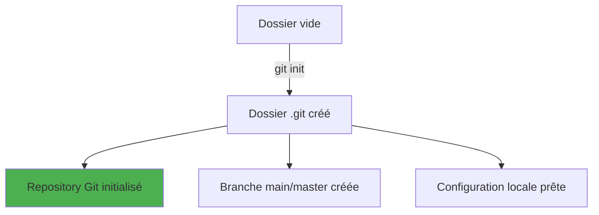

## 2. git config
**Configurer Git avec votre nom, email et autres préférences**
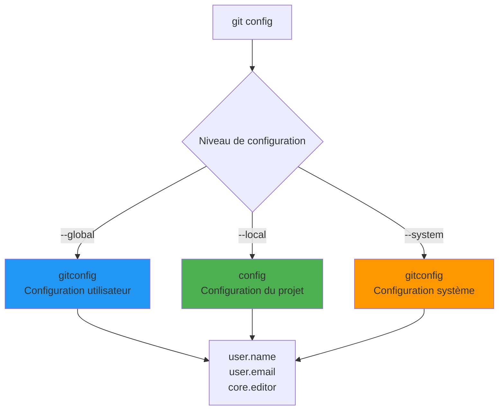

## 3. git clone
**Télécharger et copier un dépôt distant sur votre machine**
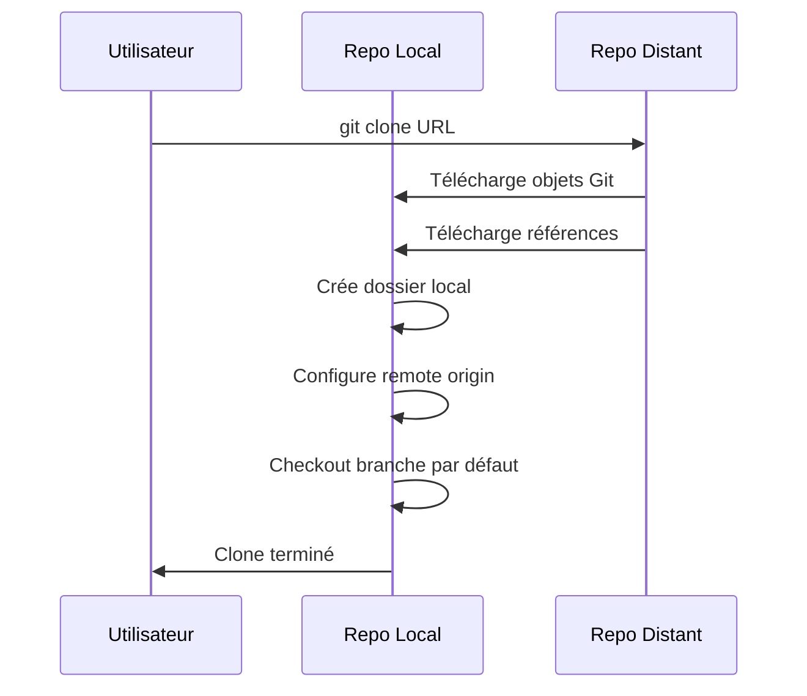

## 4. git status
**Vérifier l'état actuel de votre répertoire de travail**
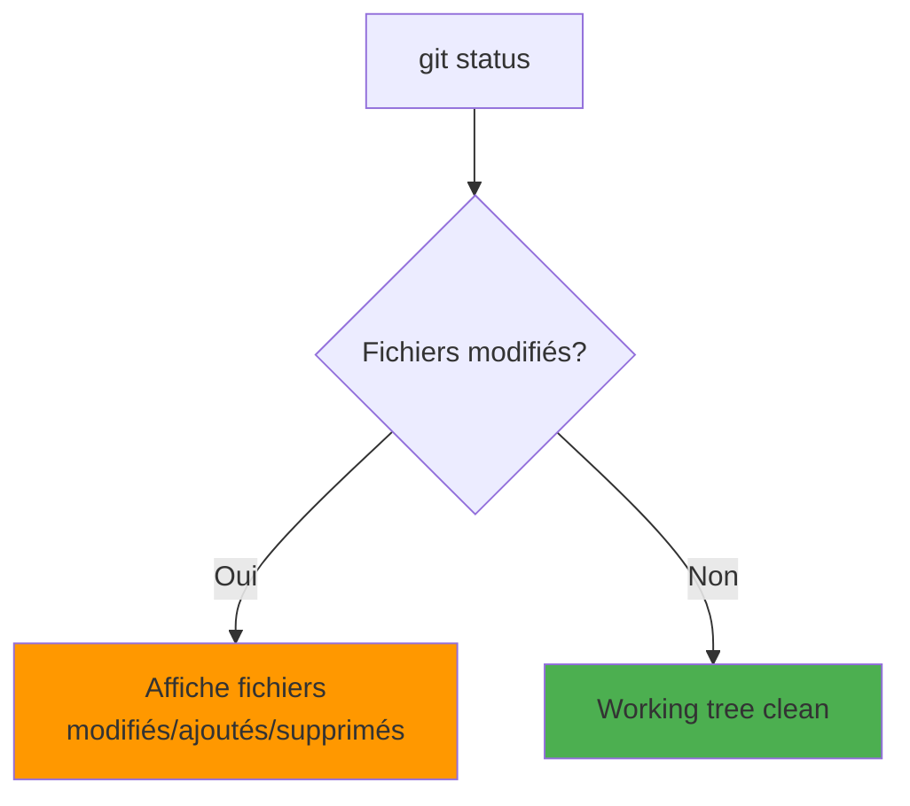

## 5. git add
**Ajouter des fichiers modifiés à la zone de staging (index)**


## 6. git diff
**Comparer les différences entre versions de fichiers**
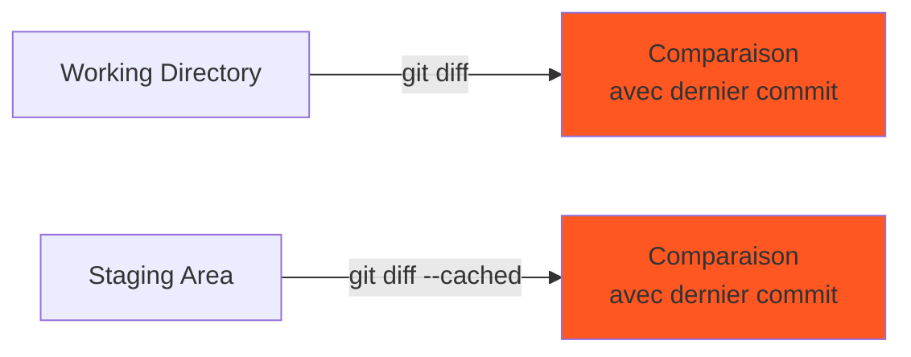

## 7. git commit
**Enregistrer les changements staged dans l'historique Git**


## 8. git log
**Afficher l'historique des commits**
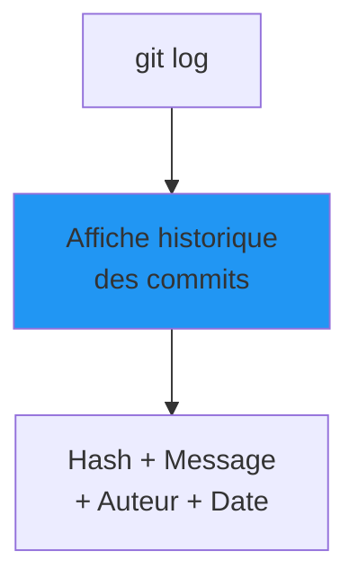

## 9. git blame
**Voir qui a modifié chaque ligne d'un fichier**
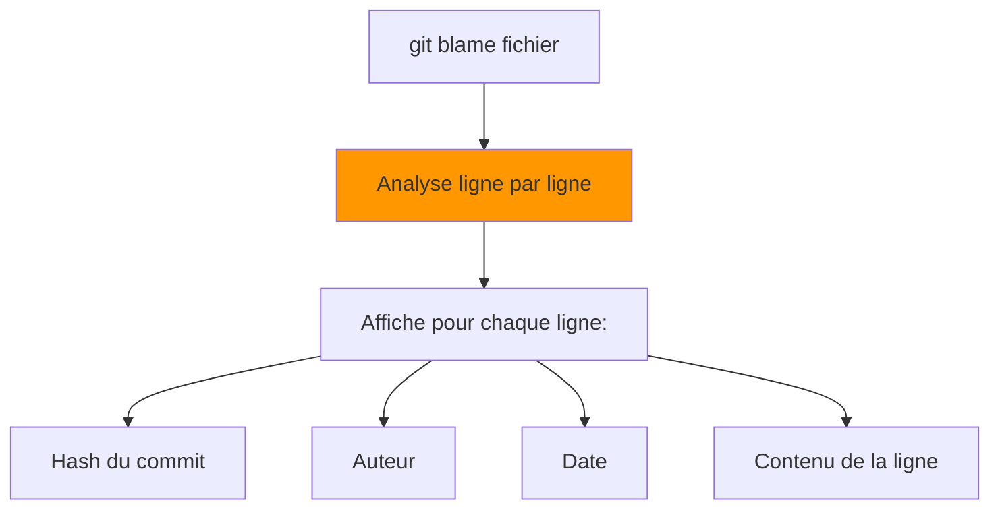

## 10. git branch
**Créer, lister ou supprimer des branches**
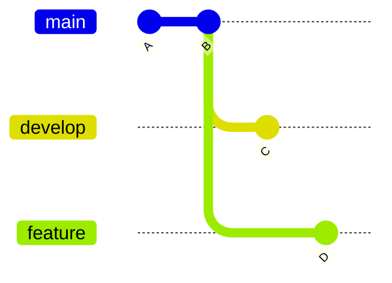

## 11. git checkout / git switch
**Changer de branche ou restaurer des fichiers**


## 12. git merge
**Fusionner une branche dans la branche actuelle**
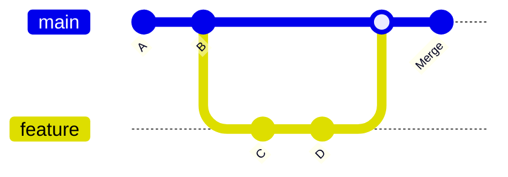

## 13. git rebase
**Rejouer des commits sur une autre base**
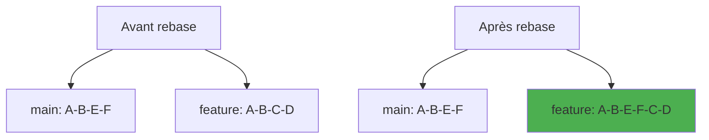

## 14. git cherry-pick
**Appliquer un commit spécifique d'une autre branche**
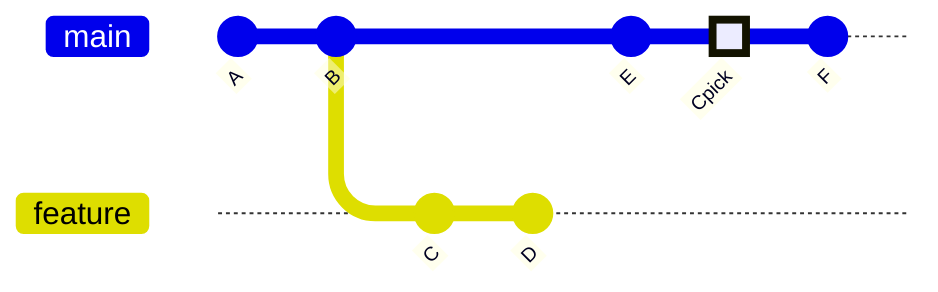

## 15. git stash
**Sauvegarder temporairement des modifications non commitées**
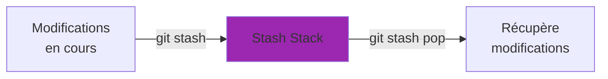

## 16. git stash list
**Afficher tous les stashs sauvegardés**
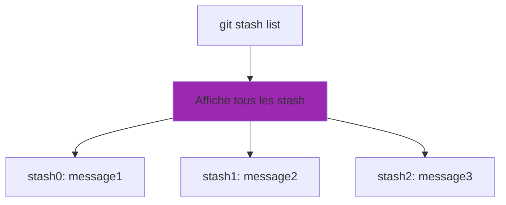

## 17. git stash drop
**Supprimer un ou plusieurs stashs**
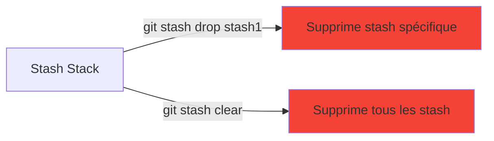

## 18. git show
**Afficher les détails d'un commit spécifique**
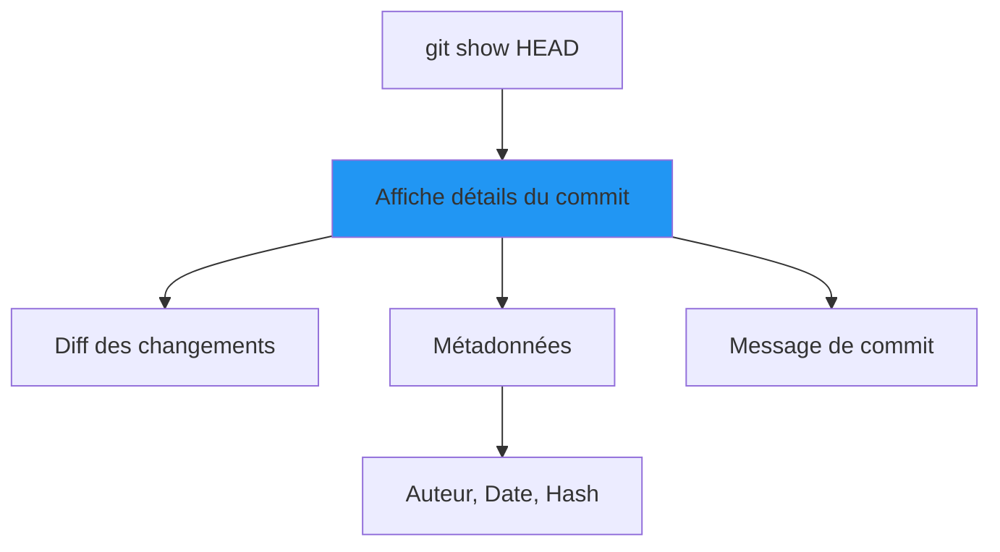

## 19. git rm
**Supprimer des fichiers du dépôt Git**
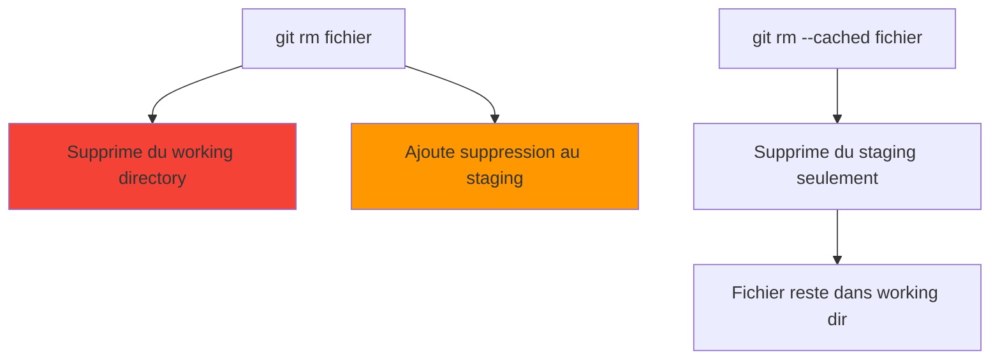

## 20. git mv
**Renommer ou déplacer des fichiers dans Git**
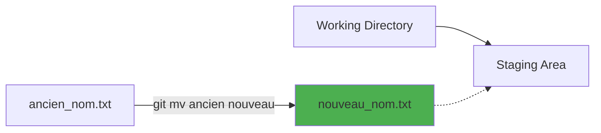

## 21. git restore
**Restaurer des fichiers à partir de commits précédents**
```mermaid
flowchart TD
    A[git restore file] --> B[Restaure fichier depuis<br/>dernier commit]
    C[git restore --staged file] --> D[Retire fichier du<br/>staging area]
    E[git restore --source HEAD~1 file] --> F[Restaure fichier depuis<br/>commit spécifique]
    
    G[Working Directory] --> H[Staging Area] 
    H --> I[Repository]
    
    B -.-> G
    D -.-> H
    F -.-> G
    
    style B fill:#4caf50
    style D fill:#ff9800
    style F fill:#2196f3
```

## 22. git reset
**Annuler des commits ou modifier l'état du staging**
```mermaid
flowchart TD
    A[git reset --soft HEAD~1] --> B[Annule dernier commit<br/>Garde les changements staged]
    C[git reset --mixed HEAD~1] --> D[Annule dernier commit<br/>Changements dans working dir]
    E[git reset --hard HEAD~1] --> F[Annule dernier commit<br/>Supprime tous les changements]
    style B fill:#f44336
```

## 23. git revert
**Créer un nouveau commit qui annule les changements d'un commit précédent**
```mermaid
gitGraph
    commit id: "A"
    commit id: "B" type: HIGHLIGHT
    commit id: "C"
    commit id: "Revert B"
```

## 24. git clean
**Supprimer les fichiers non suivis du répertoire de travail**
```mermaid
flowchart TD
    A[git clean -n] --> B[Affiche fichiers à supprimer<br/>Mode dry-run]
    C[git clean -f] --> D[Supprime fichiers non trackés]
    E[git clean -fd] --> F[Supprime fichiers et dossiers<br/>non trackés]
    style D fill:#f44336
    style F fill:#f44336
```

## 25. git grep
**Rechercher du texte dans les fichiers du dépôt**
```mermaid
flowchart TD
    A[git grep pattern] --> B[Recherche dans tous les fichiers trackés]
    B --> C[fichier1.txt: ligne contenant pattern]
    B --> D[fichier2.js: autre ligne avec pattern]
    style B fill:#ff9800
```

## 26. git reflog
**Voir l'historique des changements de références (HEAD, branches)**
```mermaid
flowchart TD
    A[git reflog] --> B[Historique des références HEAD]
    B --> C[HEAD0: commit message]
    B --> D[HEAD1: checkout branch]
    B --> E[HEAD2: reset --hard]
    style B fill:#9c27b0
```

## 27. git remote
**Gérer les dépôts distants connectés**
```mermaid
flowchart TD
    A[Repo Local] --> B[origin<br/>URL principale]
    A --> C[upstream<br/>Fork original]
    A --> D[other<br/>Autre remote]
    style B fill:#4caf50
```

## 28. git remote add/remove
**Ajouter, supprimer ou renommer des dépôts distants**
```mermaid
flowchart LR
    A[git remote add upstream URL] --> B[Ajoute nouveau remote]
    C[git remote remove origin] --> D[Supprime remote existant]
    E[git remote rename old new] --> F[Renomme remote]
    style B fill:#4caf50
    style D fill:#f44336
```

## 29. git fetch
**Télécharger les changements depuis un dépôt distant sans les fusionner**
```mermaid
sequenceDiagram
    participant L as Repo Local
    participant R as Repo Distant

    L->>R: git fetch
    R->>L: Télécharge nouveaux commits
    R->>L: Met à jour origin/branch
    Note over L: Working directory inchangé
```

## 30. git pull
**Télécharger et fusionner les changements depuis un dépôt distant**
```mermaid
sequenceDiagram
    participant L as Repo Local
    participant R as Repo Distant

    L->>R: git pull
    R->>L: Télécharge nouveaux commits
    L->>L: Merge automatique
    L->>L: Met à jour working directory
```

## 31. git push
**Envoyer les commits locaux vers un dépôt distant**
```mermaid
sequenceDiagram
    participant L as Repo Local
    participant R as Repo Distant

    L->>R: git push origin branch
    R->>R: Met à jour les références
    R->>L: Confirmation
```

## 32. git push (variantes)
**Options avancées pour l'envoi des commits**
```mermaid
flowchart TD
    A[git push -u origin branch] --> B[Push + set upstream]
    C[git push --force] --> D[Push forcé<br/>⚠️ Dangereux]
    E[git push --tags] --> F[Push tous les tags]
    style D fill:#f44336
```

## 33. git tag
**Créer des étiquettes pour marquer des versions**
```mermaid
gitGraph
    commit id: "A"
    commit id: "B" tag: "v1.0"
    commit id: "C"
    commit id: "D" tag: "v1.1"
```

## 34. git tag (gestion)
**Créer, supprimer et gérer les tags**
```mermaid
flowchart TD
    A[git tag v1.0] --> B[Crée tag léger]
    C[git tag -a v1.0 -m message] --> D[Crée tag annoté]
    E[git tag -d v1.0] --> F[Supprime tag local]
    G[git push --delete origin v1.0] --> H[Supprime tag distant]
    style F fill:#f44336
    style H fill:#f44336
```

## 35. git archive
**Créer une archive (zip/tar) du contenu du dépôt**
```mermaid
flowchart LR
    A[Repository] -->|git archive --format=zip HEAD| B[archive.zip]
    A -->|git archive --format=tar HEAD| C[archive.tar]
    style B fill:#4caf50
    style C fill:#4caf50
```

## 36. git bisect
**Utiliser la recherche dichotomique pour trouver un commit défectueux**
```mermaid
flowchart TD
    A[git reset --soft HEAD~1] --> B[Annule dernier commit<br/>Garde les changements staged]
    C[git reset --mixed HEAD~1] --> D[Annule dernier commit<br/>Changements dans working dir]
    E[git reset --hard HEAD~1] --> F[Annule dernier commit<br/>Supprime tous les changements]
    style F fill:#f44336
```

## 23. git revert
```mermaid
gitGraph
    commit id: "A"
    commit id: "B" type: HIGHLIGHT
    commit id: "C"
    commit id: "Revert B"
```

## 24. git clean
```mermaid
flowchart TD
    A[git clean -n] --> B[Affiche fichiers à supprimer<br/>Mode dry-run]
    C[git clean -f] --> D[Supprime fichiers non trackés]
    E[git clean -fd] --> F[Supprime fichiers et dossiers<br/>non trackés]
    style D fill:#f44336
    style F fill:#f44336
```

## 25. git grep
```mermaid
flowchart TD
    A[git grep pattern] --> B[Recherche dans tous les fichiers trackés]
    B --> C[fichier1.txt: ligne contenant pattern]
    B --> D[fichier2.js: autre ligne avec pattern]
    style B fill:#ff9800
```

## 26. git reflog
```mermaid
flowchart TD
    A[git reflog] --> B[Historique des références HEAD]
    B --> C[HEAD0: commit message]
    B --> D[HEAD1: checkout branch]
    B --> E[HEAD2: reset --hard]
    style B fill:#9c27b0
```

## 27. git remote
```mermaid
flowchart TD
    A[Repo Local] --> B[origin<br/>URL principale]
    A --> C[upstream<br/>Fork original]
    A --> D[other<br/>Autre remote]
    style B fill:#4caf50
```

## 28. git remote add/remove
```mermaid
flowchart LR
    A[git remote add upstream URL] --> B[Ajoute nouveau remote]
    C[git remote remove origin] --> D[Supprime remote existant]
    E[git remote rename old new] --> F[Renomme remote]
    style B fill:#4caf50
    style D fill:#f44336
```

## 29. git fetch
```mermaid
sequenceDiagram
    participant L as Repo Local
    participant R as Repo Distant

    L->>R: git fetch
    R->>L: Télécharge nouveaux commits
    R->>L: Met à jour origin/branch
    Note over L: Working directory inchangé
```

## 30. git pull
```mermaid
sequenceDiagram
    participant L as Repo Local
    participant R as Repo Distant

    L->>R: git pull
    R->>L: Télécharge nouveaux commits
    L->>L: Merge automatique
    L->>L: Met à jour working directory
```

## 31. git push
```mermaid
sequenceDiagram
    participant L as Repo Local
    participant R as Repo Distant

    L->>R: git push origin branch
    R->>R: Met à jour les références
    R->>L: Confirmation
```

## 32. git push (variantes)
```mermaid
flowchart TD
    A[git push -u origin branch] --> B[Push + set upstream]
    C[git push --force] --> D[Push forcé<br/>⚠️ Dangereux]
    E[git push --tags] --> F[Push tous les tags]
    style D fill:#f44336
```

## 33. git tag
```mermaid
gitGraph
    commit id: "A"
    commit id: "B" tag: "v1.0"
    commit id: "C"
    commit id: "D" tag: "v1.1"
```

## 34. git tag (gestion)
```mermaid
flowchart TD
    A[git tag v1.0] --> B[Crée tag léger]
    C[git tag -a v1.0 -m message] --> D[Crée tag annoté]
    E[git tag -d v1.0] --> F[Supprime tag local]
    G[git push --delete origin v1.0] --> H[Supprime tag distant]
    style F fill:#f44336
    style H fill:#f44336
```

## 35. git archive
```mermaid
flowchart LR
    A[Repository] -->|git archive --format=zip HEAD| B[archive.zip]
    A -->|git archive --format=tar HEAD| C[archive.tar]
    style B fill:#4caf50
    style C fill:#4caf50
```

## 36. git bisect
```mermaid
flowchart TD
    A[git bisect start] --> B[git bisect bad HEAD]
    B --> C[git bisect good v1.0]
    C --> D[Git sélectionne commit milieu]
    D --> E{Test du commit}
    E -->|Bug présent| F[git bisect bad]
    E -->|Bug absent| G[git bisect good]
    F --> H[Git sélectionne nouveau commit]
    G --> H
    H --> I[Commit fautif trouvé]
    style I fill:#f44336
```
